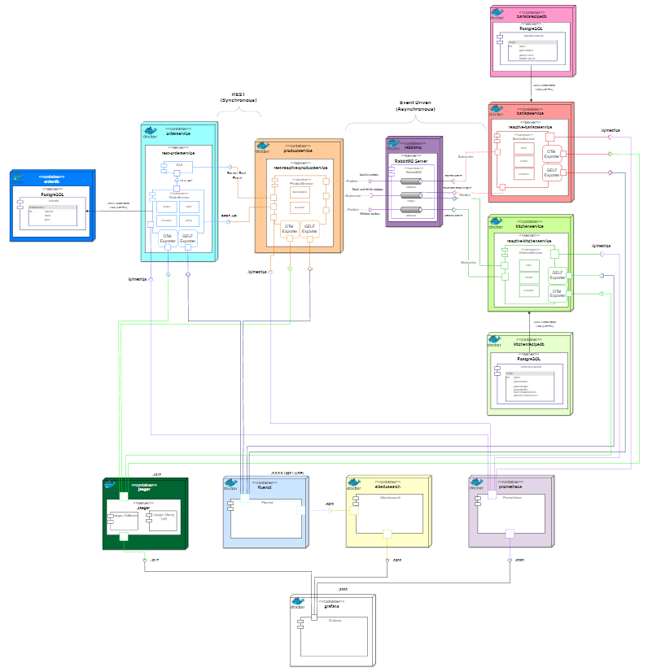

# <p align=center> CoffeeShop Demo System - Sean Bäker Bachelor Thesis Project</p>
<p align = center>Applicability of Observability in Microservice-based Systems
based systems using the example of a demo application
</p>
<p align="center">
  
</p>

<!--TOC-->
* [Introduction](#introduction)
  * [Order Service](#orderservice)
  * [Product Service](#productservice)
  * [Kitchen Service](#kitchenservice)
  * [Barista Service](#baristaservice)
* [Observability](#observability)
  * [MicroProfile](#microprofile)
  * [Quarkus](#quarkus)
  * [OpenTelemetry](#opentelemetry)
  * [Fluentd](#fluentd)
  * [Prometheus](#prometheus)
  * [Grafana](#grafana)
* [Installation](#installation)
* [Usage](#usage)
* [Features](#features)
* [Troubleshooting](#troubleshooting)
<!--TOC-->

## Introduction
The demo application developed for this work, under the name Coffee Shop, is based on an Event-Driven-Architecture and 
represents a replica of an ordering process in a system catering environment. 
The application consists of four components that exchange data with each other using different types of 
communication. Both synchronous and asynchronous communication mechanisms are used to reflect real industry scenarios.

<p align="center">
  
</p>

The image shows the underlying architecture of the coffeeshop system together
with the communication mechanisms used. Clients can interact with the System via
the GUI and place orders that can either be food or drink orders.

The following chapters give a quick overview over the components of the System c

#### GUI
<p align="center">
  
</p>

The GUI is the entry point for customers in which they can place food or drink 
orders.

### OrderService

The OrderService receives the order from the GUI and persists it in the 
defaultorders database (PostgreSQL), after persisting the order is then 
sent to the ProductService in JSON format via a REST-API for further processing.

### ProductService

The ProductService receives the order, classifies it based on the name of the order
and then publishes it in the according queue, either the barista-in or kitchen-in
queue.
Furthermore, it also listens on the recipe queue for incoming recipes from the
Kitchen- or BaristaService

### KitchenService

The KitchenService listens on the kitchen-in queue, retrieves the recipe from
the KitchenRecipeDB based on the name of the order and 
publishes that recipe in the recipes queue.

### BaristaService

The BaristaService listens on the barista-in queue, retrieves the recipe from
the BaristaServiceDB based on the name of the order and
publishes that recipe in the recipes queue.

### Observability

#### MicroProfile

[MicroProfile](https://microprofile.io/) is a community-driven specification designed to provide a baseline platform definition that 
optimizes the Enterprise Java for microservices architecture and delivers application portability across 
multiple MicroProfile runtimes. 
It gives Java developers a platform to collaborate and innovate on areas of common interest.
The MicroProfile specification consists of a collection of Enterprise Java APIs and technologies that together 
form a core baseline for microservices that aims to deliver application portability across multiple runtimes.

<p align="center">
  
</p>

#### Quarkus

Quarkus is a framework build upon the best java libraries and patterns. 
The mains Quarkus’s goals are to allow faster development and application initializations, 
being smaller and consuming fewer machine resources. 
Quarkus born with the idea to be Cloud Native, be used in Microservices and Serverless projects.

<p align="center">
  
</p>

#### OpenTelemetry

OpenTelemetry is an Observability framework and toolkit designed to create and manage 
telemetry data such as traces, metrics, and logs. Crucially, OpenTelemetry is vendor- and 
tool-agnostic, meaning that it can be used with a broad variety of Observability backends, 
including open source tools like Jaeger and Prometheus, as well as commercial offerings. 
OpenTelemetry is a Cloud Native Computing Foundation (CNCF) project.

#### fluentd

Fluentd is an open source data collector, which lets you unify the data collection and 
consumption for a better use and understanding of data.

Unified Logging with JSON:
Fluentd tries to structure data as JSON as much as possible: this allows Fluentd to unify 
all facets of processing log data: collecting, filtering, buffering, and outputting logs 
across multiple sources and destinations (Unified Logging Layer). The downstream data 
processing is much easier with JSON, since it has enough structure to be accessible while 
retaining flexible schemas.

Pluggable Architecture:
Fluentd has a flexible plugin system that allows the community to extend its functionality.
Over 500 community-contributed plugins connect dozens of data sources and data outputs. 
By leveraging the plugins, you can start making better use of logs right away.

Minimum Resources Required:
Fluentd is written in a combination of C language and Ruby, and requires very little 
system resource. The vanilla instance runs on 30-40MB of memory and can process 
13,000 events/second/core. If you have tighter memory requirements (-450kb), check out 
Fluent Bit, the lightweight forwarder for Fluentd.

Built-in Realiability:
Fluentd supports memory- and file-based buffering to prevent inter-node data loss. 
Fluentd also supports robust failover and can be set up for high availability. 
2,000+ data-driven companies rely on Fluentd to differentiate their products and services 
through a better use and understanding of their log data.

#### Prometheus
Prometheus is an open-source systems monitoring and alerting toolkit originally built at 
SoundCloud. Since its inception in 2012, many companies and organizations have adopted 
Prometheus, and the project has a very active developer and user community. 
It is now a standalone open source project and maintained independently of any company. 
To emphasize this, and to clarify the project's governance structure, Prometheus joined 
the Cloud Native Computing Foundation in 2016 as the second hosted project, after Kubernetes.

Prometheus collects and stores its metrics as time series data, i.e. metrics information 
is stored with the timestamp at which it was recorded, alongside optional key-value pairs 
called labels.

#### Grafana 
Grafana is an open source interactive data-visualization platform, developed by Grafana Labs,
which allows users to see their data via charts and graphs that are unified into one 
dashboard (or multiple dashboards!) for easier interpretation and understanding. 
You can also query and set alerts on your information and metrics from wherever that 
information is stored, whether that’s traditional server environments, Kubernetes clusters,
or various cloud services, etc. You’re then more easily able to analyze the data, identify 
trends and inconsistencies, and ultimately make your processes more efficient. 
Grafana was built on open principles and the belief that data should be accessible 
throughout an organization, not just to a small handful of people. 
This fosters a culture where data can be easily found and used by anyone who needs it, 
empowering teams to be more open, innovative, and collaborative.

## Installation

The coffeeshop system contains a folder called "docker" within that folder are on the one 
hand database initialization scripts, Grafana provisioning and a Prometheus configuration.
Furthermore, there are several docker compose files for each microservice of the demo
application and for the observability layer.

Before you can build the docker compose files and see the system in action you first have
to build the needed docker images for the services, to do that follow these steps:

1. Start the docker engine
2. Open the project in your IDE and open four terminal windows and run the following commands:
In the first shell
```shell
  cd orderservice
```
```shell
  #This builds the docker image because the projects have Jib (Java Image Builder) 
  #included as a dependency
  #Be aware that using Jib is quite resource intensive and might slow your machine down quite
  #a bit during and after the image building for some time
  mvn clean install
```
in the second shell
```shell
  cd productservice
```
```shell
  mvn clean install
```
in the third shell
```shell
  cd kitchenservice
```
```shell
  mvn clean install
```
and in the fourth shell
```shell
  cd baristaservice
```
```shell
  mvn clean install
```

Now you created four docker images which should be available in docker, check availability with the following 
command:

```shell
docker image ls
```

Once you have confirmed the availability you can move on to running the system, check that
you have the following files by following these steps:
1. Change directory to the docker folder
2. here you find five docker compose files:
   1. orderservice-docker-compose.yml
   2. productservice-docker-compose.yml
   3. kitchenservice-docker-compose.yml
   4. baristaservice-docker-compose.yml
   5. observability-docker-compose.yml
3. Now run the following command: 
```shell
docker-compose -f service-common-docker-compose.yml -f orderservice-docker-compose.yml -f productservice-docker-compose.yml -f kitchenservice-docker-compose.yml -f baristaservice-docker-compose.yml -f observability-docker-compose.yml up
```
4. Now you should see the system up and running in your docker environment

## Usage
To interact with the system go to the following url:
```shell 
http://localhost:8080
```
this will bring you to the GUI in which you can order anything you like :) .
Upon ordering, you should see the recipe appearing in the textbox presenting you with
the ingredients in your order.

To see the traces & spans, metrics and logs go to: 
```shell 
http://localhost:3000
```
This brings you to Grafana, on the left hand side you should see a "Dashboards" tab 
click on that and then choose either Log Dashboard, Tracing Dashboard, Overall Health 
Dashboard or the Dashboards for the individual services with individual metrics!

## Troubleshooting

ElasticSearch seems to have a problem with the allocated memory size by docker desktop
which it lets you know via this log message:
```
{"@timestamp":"2023-07-05T16:24:10.302Z", "log.level":"ERROR", 
"message":"node validation exception\n[1] bootstrap checks failed. 
You must address the points described in the following [1] lines before starting 
Elasticsearch.\nbootstrap check failure [1] of [1]: max virtual memory areas 
vm.max_map_count [65530] is too low, increase to at least [262144]", 
"ecs.version": "1.2.0","service.name":"ES_ECS","event.dataset":"elasticsearch.server",
"process.thread.name":"main","log.logger":"org.elasticsearch.bootstrap.Elasticsearch",
elasticsearch.node.name":"elasticsearch","elasticsearch.cluster.name":"docker-cluster"}
```
to forego this issue do the following: 
```shell
#This is for windows
#Important to note, this is only a fix for as long your machine is running
wsl -d docker-desktop
sysctl -w vm.max_map_count=262144

#To make permanent changes do the following
wsl -d docker-desktop
grep vm.max_map_count /etc/sysctl.conf
vm.max_map_count=262144

# for MacOS or Linux based Systems do this for temporary changes
sysctl -w vm.max_map_count=262144

#and this for permanent changes
grep vm.max_map_count /etc/sysctl.conf
vm.max_map_count=262144
```