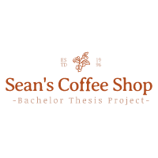

# 
 CoffeeShop Demo System - Sean Bäker Bachelor Thesis Project

Applicability of Observability in Microservice-based Systems
based systems using the example of a demo application

  

<!--TOC-->
* [Introduction](#introduction)
  * [Order Service](#orderservice)
  * [Product Service](#productservice)
  * [Kitchen Service](#kitchenservice)
  * [Barista Service](#baristaservice)
* [Overview](#overview)
  * [Demo Application Architecture](#architecture)
  * [Data flow](#data flow)
* [Observability](#observability)
  * [MicroProfile](#microprofile)
  * [Quarkus](#quarkus)
  * [OpenTelemetry](#opentelemetry)
  * [Fluentd](#fluentd)
  * [Prometheus](#prometheus)
  * [Grafana](#grafana)
* [Overall Architecture](#overall architecture)
* [Installation](#installation)
* [Usage](#usage)
* [Features](#features)
* [Documentation](#documentation)
<!--TOC-->

## Introduction
This System was built to showcase a reference architecture for Observability in distributed
systems, at its core it consists of four services and several other third-party components. 

The idea behind this application was to represent an Event-Driven-Architecture, in which it is often 
difficult to trace the paths of communication within the application due to the distributed nature of the services
making up the system as a whole. 

The following lines are closer and more in depth look at the: 
- components making up the base application
- technology stack used in the base application
- components making up the observability stack
- technology stack used in the observability stack

### OrderService

#### GUI

  

### ProductService

### KitchenService

### BaristaService
